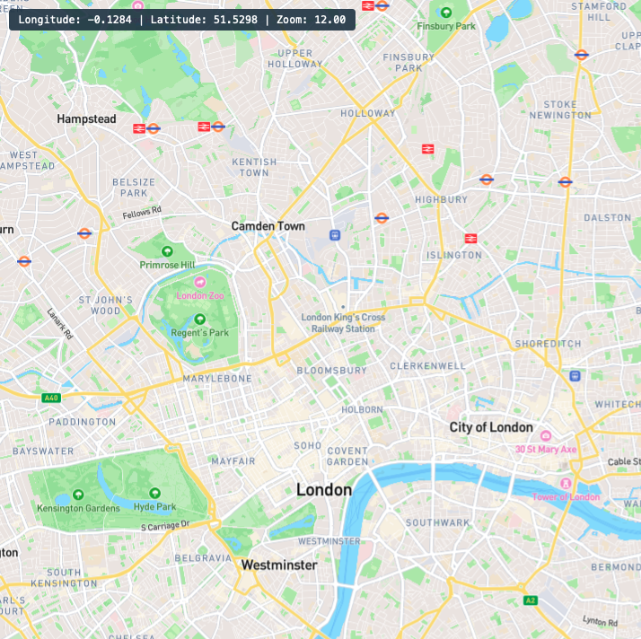
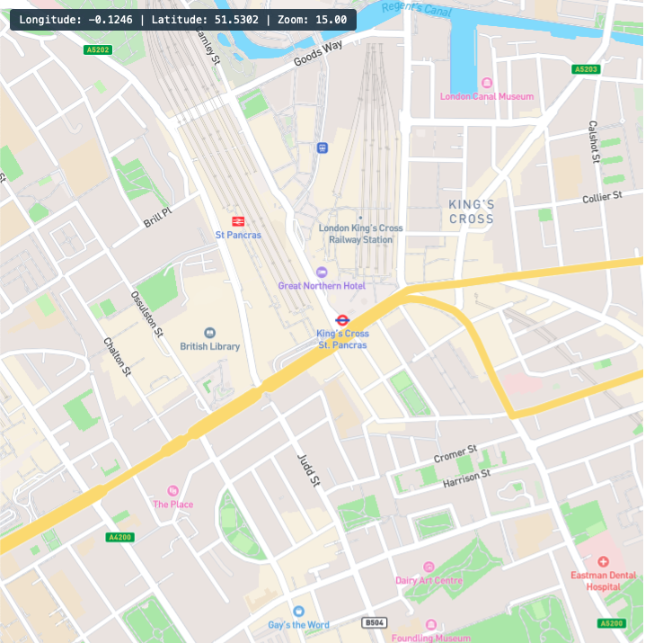

# Mapbox

## Glossary

**Datasets** provide access to feature geometries (points, lines, and polygons) and properties (attributes), both of which can be edited in the Mapbox Studio dataset editor or through the Mapbox Datasets API.

**Tilesets** are lightweight collections of vector data that are optimized for rendering (preset zoom levels) and are not editable but can be styled in the Mapbox Studio style editor.

Web maps are comprised of map tiles - Tilesets are created from datasets.

## Collaboration

'Mapbox accounts are shared accounts. Mapbox accounts do not support individual user accounts, or a nested account hierarchy in which multiple accounts are connected to one another. When sharing an account, we recommend you manage your organization's access to Mapbox accounts with SAML Single sign-on (SSO).' [How to enable SSO](https://docs.mapbox.com/accounts/guides/settings/#single-sign-on-authentication-sso).

## [Pricing](https://www.mapbox.com/pricing)

Every area of Mapbox has a **FREE** tier. Paid usage follows a pay as you go model. The following limits apply for free usage:

### Maps

Map JS object loads - 50k/month

Mapbox serves various tile types each with their own request limit:

| Type          | Monthly limit |
| ------------- | ------------- |
| Static image  | 50,000        |
| Vector        | 200,000       |
| Static raster | 200,000       |
| Raster        | 750,000       |

`Tilequery` for retrieving data about specific features from a vector tileset e.g. elevation at a certain lat/long. Limit of 100,000/month requests.

### Search

Geocoding (search) API - 100k/month requests
Permanent (store results) and batch geocoding is paid.

- 50,000/month static images (non-interactive),

### Tileset processing/hosting

Tileset limits are based on zoom level e.g. 1,000,000km<sup>2</sup>/month of tilesets at zoom 11-13 can be created. Higher zoom (more detail) means lower km<sup>2</sup>/month. Hosting usage is the area of all tiles that were created multiplied by the number of days each tileset has existed in your account - hosting limit is the processing limit (of the same zoom level) multiplied by 30.

Example of zoom level 12



Example of zoom level 15



### Rate limits

[Mapbox rate limits](https://docs.mapbox.com/api/overview/#rate-limits)

## Datasets

Map coordinate upload is either CSV or GeoJSON.

Can be uploaded via [`Uploads API`](https://docs.mapbox.com/help/glossary/uploads-api/) or `Mapbox Studio`.

CSV example

```
title,latitude,longitude
University at Albany,42.686744,-73.822852
Siena College,42.718588,-73.755328
Union College,42.814403,-73.930967
The College of St. Rose,42.664351,-73.786562
```

GeoJSON example

```json
{
  "features": [
    {
      "type": "Feature",
      "properties": {
        "title": "Lincoln Park",
        "description": "A northside park that is home to the Lincoln Park Zoo"
      },
      "geometry": {
        "coordinates": [-87.637596, 41.940403],
        "type": "Point"
      }
    },
    {
      "type": "Feature",
      "properties": {
        "title": "Burnham Park",
        "description": "A lakefront park on Chicago's south side"
      },
      "geometry": {
        "coordinates": [-87.603735, 41.829985],
        "type": "Point"
      }
    }
  ],
  "type": "FeatureCollection"
}
```

## Location search

The Mapbox API supports both [forward and reverse geocoding](https://docs.mapbox.com/api/search/geocoding/).

### Forward geocoding

The request `https://api.mapbox.com/geocoding/v5/mapbox.places/Eston%20Road%2C%20Middlesbrough%2C%20Cleveland%20TS6%206US.json?access_token=YOUR_MAPBOX_ACCESS_TOKEN` produces a response of an array of `features` (default length `5`) ordered by relevance. An example of a **single** feature:

```json
{
  "id": "address.1570957797631746",
  "type": "Feature",
  "place_type": ["address"],
  "relevance": 0.680556,
  "properties": {
    "accuracy": "street"
  },
  "text": "Eston Road",
  "place_name": "Eston Road, South Bank, Middlesbrough, TS6 6US, United Kingdom",
  "center": [-1.1595222, 54.5800431],
  "geometry": {
    "type": "Point",
    "coordinates": [-1.1595222, 54.5800431]
  },
  "context": [
    {
      "id": "postcode.13073534543",
      "text": "TS6 6US"
    },
    {
      "id": "locality.162507343",
      "wikidata": "Q1616694",
      "text": "South Bank"
    },
    {
      "id": "place.7522383",
      "wikidata": "Q171866",
      "text": "Middlesbrough"
    },
    {
      "id": "district.1009231",
      "wikidata": "Q1434448",
      "text": "Redcar And Cleveland"
    },
    {
      "id": "region.9295",
      "short_code": "GB-ENG",
      "wikidata": "Q21",
      "text": "England"
    },
    {
      "id": "country.8783",
      "short_code": "gb",
      "wikidata": "Q145",
      "text": "United Kingdom"
    }
  ]
}
```

Some optional parameters that could be useful for this project:

| Parameter    | Description                                                                                                                                   |
| ------------ | --------------------------------------------------------------------------------------------------------------------------------------------- |
| Autocomplete | When autocomplete is enabled, results will be included that start with the requested string, rather than just responses that match it exactly |
| Country      | Limit results to one or more countries                                                                                                        |
| Limit        | Specify the maximum number of results to return (up to 10)                                                                                    |
| Proximity    | Bias the response to favour results that are closer to this location                                                                          |

### Reverse geocoding

A reverse geocoding request uses `{long],{lat}.json` e.g. `https://api.mapbox.com/geocoding/v5/mapbox.places/-73.989,40.733.json?access_token=YOUR_MAPBOX_ACCESS_TOKEN` and responds with the same format as forward geocoding - a GeoJSON feature collection.

## Testing

Automated tests can be run without an access token by setting `testMode: true` when initialising the `Map`. This stops the `Map` producing visual output (the HTML `canvas`), but still loads local styles and tiles + allows use of the Mapbox API. Examples of what it's possible to test:

- Listen for interaction events like click, mouseover etc on Layers.
- Extract feature data with `map.queryRenderedFeatures()`.
- Update view state center, pitch, bearing, `map.easeTo()`, `map.flyTo()` etc.
- Interact with `Marker` and `Popup` instances.

## Proof of concept

A proof of concept that shows clustering of [parkrun](https://images.parkrun.com/events.json) locations around the world is viewable on the [`mapbox-test` branch](https://github.com/digicatapult/hii-client/tree/mapbox-test).
